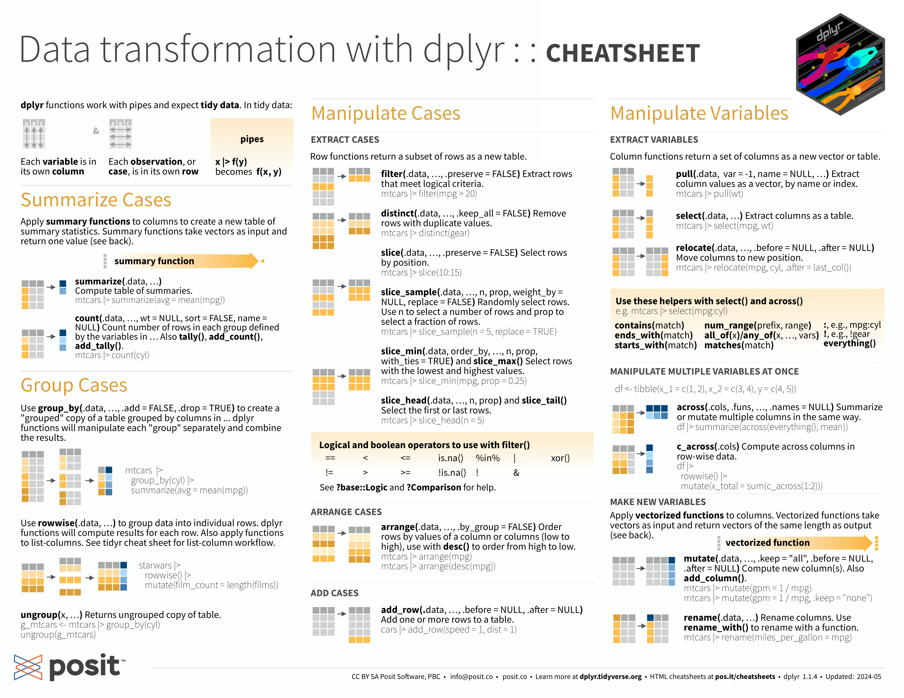
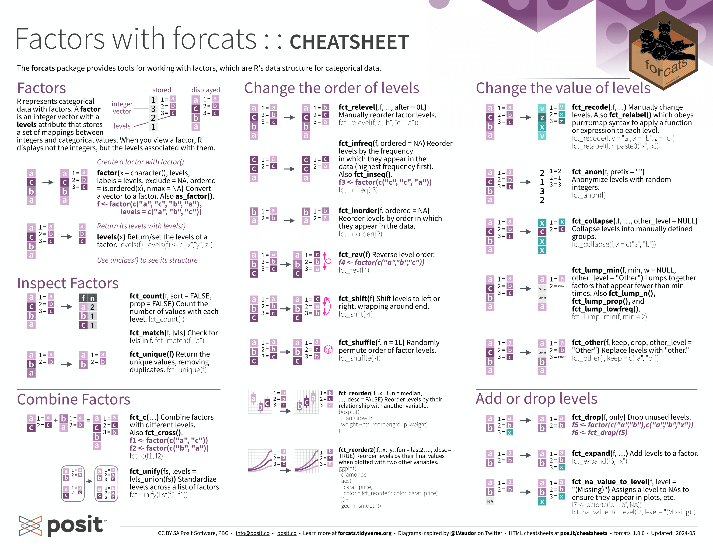
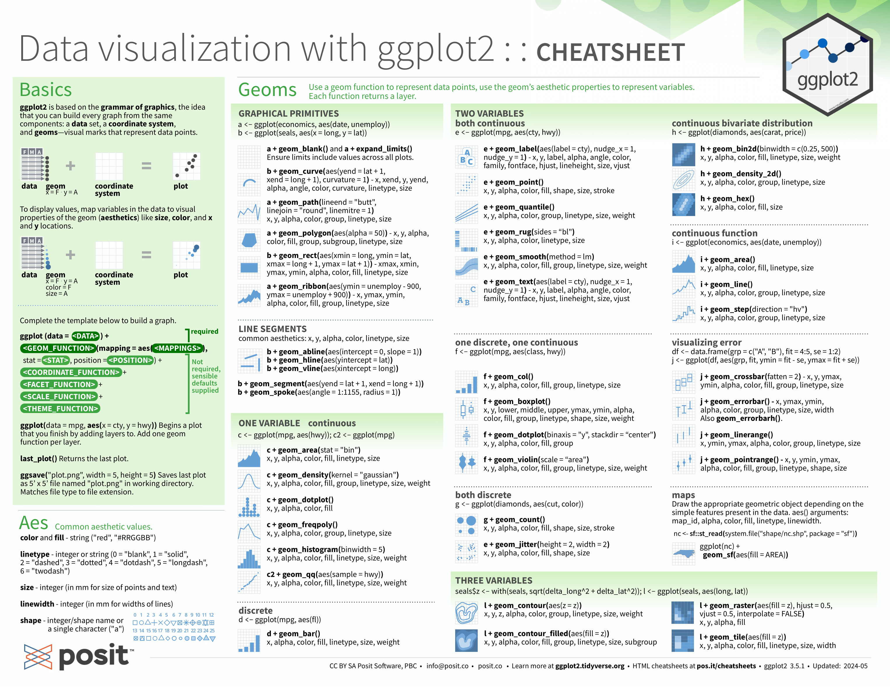
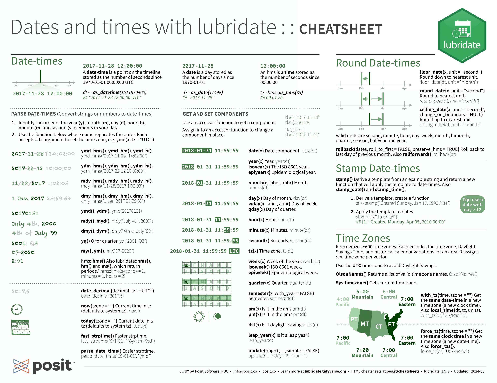
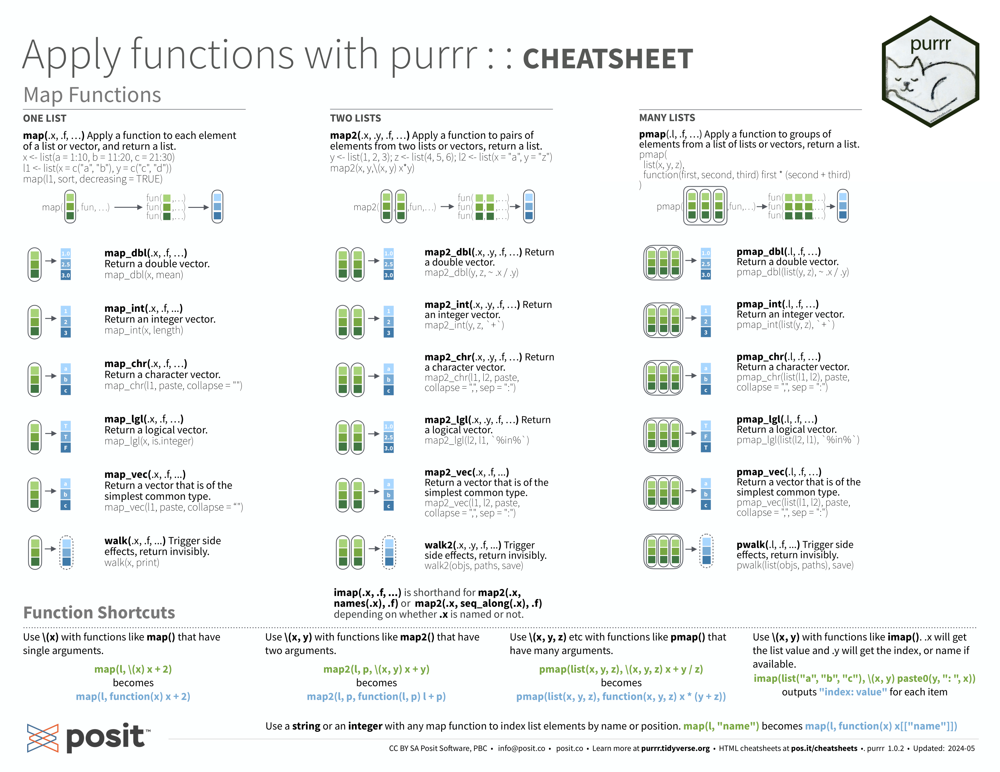
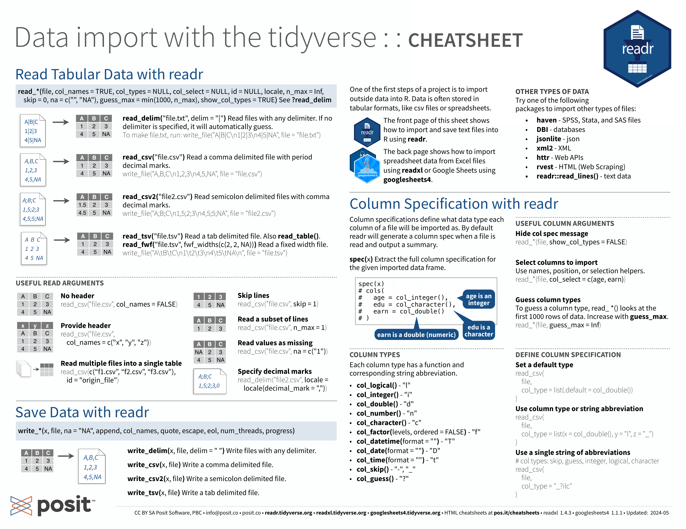
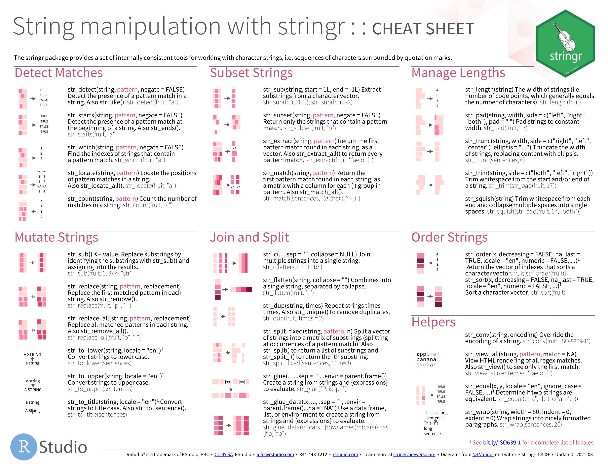
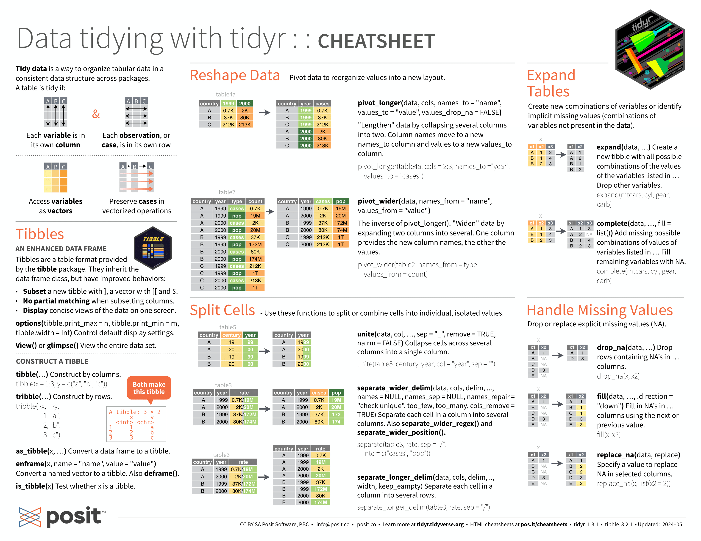

# Tidyverse

## Cheat Sheets

### dplyr: data manipulation



### forcats: categorical



### ggplot2: visualization



### lubridate: datetimes



### purrr: functions and vectors



### readr: reading



### stringr: strings



### tidyr: data wrangling



## Basics

-   Differences between tibbles and dataframes relate to printing and subsetting

-   `~` operator separates arguments to a formula

-   `.` operater is short for all columns

-   `%>%` operator allows chaining of sequences to apply over single statements

### Tidy Data

1.  Every variable is stored in its own column

2.  Every observation or sample is stored in its own row

3.  Every value is stored in its own cell

### Pivot

-   `pivot_longer` handles variables spread over multiple columns

-   `pivot_wider` handles variables spread over multiple rows

`pivot_longer` example:

```{r}
library(tidyverse)
tib <- as_tibble( matrix( nrow=3, ncol=3 ) )
colnames(tib) <- c( "country", "1999", "2000" )
tib$country <- c( "Afghanistan", "Brazil", "China" )
tib$"1999" <- c(745, 37737, 212258)
tib$"2000" <- c(2666, 80488, 213766)
print( tib )
```

```{r}
## requires you to define which columns are values and not variables (the years 1999 and 2000, in our example), the name of the new column to move the column names to, and the name of the new column to move corresponding column values to
tib %>% pivot_longer(c("1999", "2000"), names_to =			"year", values_to = "cases")
```

`pivot_wider` example

```{r}
library(vctrs)

tib <- as_tibble( matrix( nrow=12, ncol=4 ) )
colnames(tib) <- c( "country", "year", "type", "count" 		)
tib$country <- vec_rep_each( c( "Afghanistan", 		"Brazil", "China" ), times=4 )
tib$year <- vec_rep( c( 1999, 1999, 2000, 2000 ), times=3 )
tib$type <- vec_rep( c( "cases", "population" ), times=6 )
tib$count <- c( 745, 19987071, 2666, 20595360, 37737, 172006362, 80488, 174504898, 212258, 127295272, 213766, 1280428583 )
print(tib)
```

```{r}
## store type in single tibble row. provide the columns to take the new variable names from (type in the current tibble) and the column to take the corresponding values from (count)
tib %>% pivot_wider( names_from = "type",		values_from = "count")
```

## Data Manipulation

```{r}
print(starwars)
```

### Rows

`filter()`: Choose rows based on column values

```{r}
print( starwars %>% filter( skin_color=="light", eye_color=="blue" ) )
```

`slice()`: choose rows based on location

```{r}
print( starwars %>% slice(5:10) ) # Return rows 5-10 inclusive
```

`arrange()`: change row order

```{r}
print( starwars %>% arrange( height, mass ) ) # Sort rows by height, within height by mass
```

### Columns

`select()`: chooses a subset of columns

```{r}
print( starwars %>% select( name, hair_color, eye_color ) ) # Select name, hair colour, eye colour columns

print( starwars %>% select( name:eye_color ) ) # Select columns from name to eye colour

print( starwars %>% select( ends_with( "color" ) ) ) # Selects columns whose name ends w/color
```

`rename()`: Renames a column.

```{r}
print( starwars %>% rename( "Home.World"="homeworld" ) ) # Rename homeworld column to Home.World
```

`mutate()`: Changes the values of a column or creates new column(s).

```{r}
print(starwars %>%
mutate( height_m = height / 100, BMI = mass / ( height_m ^ 2 ) ) %>%
select( BMI, height_m, everything() ))
```

`relocate()`: Changes the order or columns.

```{r}
print(starwars %>%
relocate( sex:homeworld, .before=height ))
```

### Grouping

`summarise()`: collapse a group of rows into single row

```{r}
print(starwars %>%
group_by( species, sex ) %>%
dplyr::summarise( height=mean(height, na.rm=TRUE ), mass=mean(mass, na.rm=TRUE) ) %>%
select( height, mass ))
```

### 
