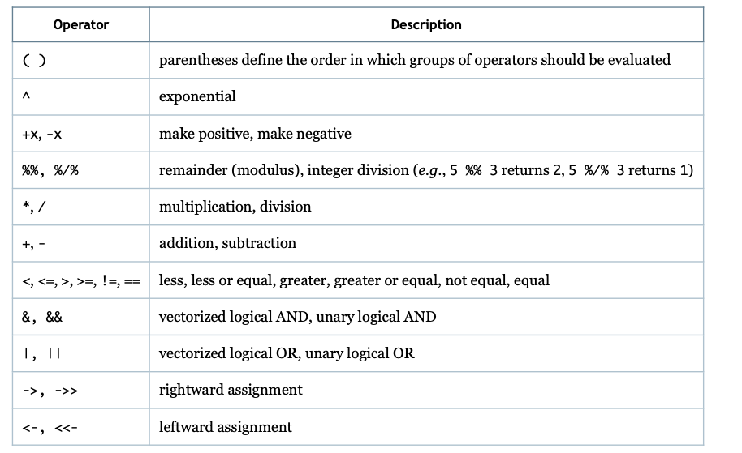
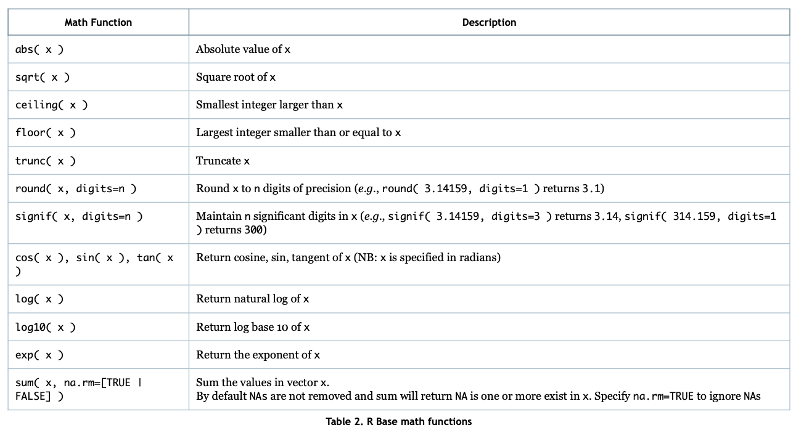

# R Basics

## Introduction

### Operators





### Variables

-   **vector:** a collection of values, created by using R's "combine" function c()

    -   must be same datatype

-   **numeric:** Numbers including floating point and integer values

-   **integer:** integer variables, whole number values having no fractional part

    -   Often suffixed with L, var \<- 10L

-   **complex:** complex numbers

    -   var \<- 9 + 3i

-   **character:** variables made up of strings (not a datatype itself)

    -   any quotes are fine

-   **logical**

## Characters

### Paste function

`paste(s, t, sep= " ", collapse=null)`: concatenate s and t, returning a new character as a result.

-   `sep` defines character used to separate s and t (default is space)

-   `collapse` is used when s and t are vectors. (`NULL` concatenates each vector separately)

```{r}
## Strings
paste( "hello", "world!", sep="." )

## Concatenates elementwise
a <- c( "1", "2", "3" )
b <- c( "a", "b", "c" )
paste( a, b )

# Example collapse which gives a string
paste( a, b, collapse="; " )
```

### Other character functions

`substring(s, i, j)` : returns ith through jth character. (s, i) retursn substring from ith until the last character

`nchar(s)` : number of characters in s

```{r}
s <- "hello world!"
print( nchar( s ) )
print( substring( s, 7, 7 ) )
print( substring( s, 3, 8 ) )
print( substring( s, 4 ) )

print( substring( s, nchar( s ) - 1 ), nchar( s ) - 1 )

print( substring( s, nchar( s ) - 2 ) )

t <- "must.. try.. harder.."
print( paste( s, t ) )
```

## Lists

-   Can take any datatype and include keyed values

```{r}
l <- list("values"=sin(1:3), "ids"=letters[1:3], "sub"=list("foo"=42,"bar"=13), "greeting"="Hello")

# Can return entry wise as a sublist l[1] or as values with l[[1]]
print( l['values'] )
str(l['values'])
print( l[["ids"]] )
print( l$sub$foo )
print( l[[c(3,2)]] )
```

## Factors

```{r}
city <- c(3, 2, 1, 4, 3, 2)
city_nm <- c( "Dublin", "London", "Sofia", "Ponteverdra" )
f <- factor( city, labels=city_nm )
print(f)

## Appending factors
new_f <- append( f, as.factor( c( "Zurich", "Berlin" ) ) )
print(new_f)
```

## Matrices

```{r}
mat <- matrix( c( 1, 2, 3, 4, 5, 6 ), nrow=3, ncol=2 )
print(mat)
```

Slicing matrix

```{r}
print(mat[1,1])

print(mat[2,])

print(mat[ c(2,3), ])
```

Binding rows and columns

```{r}
mat <- cbind( mat, c( 7, 8, 9 ), c( 10, 11,12 ) )
print(mat)
```

## Dataframe

1.  Column names are non-empty

2.  Row names are unique

3.  Data in a dataframe is numeric, character, or factor

4.  Each column has the same number of values

```{r}
df <- data.frame(
    emp_id <- c(1:5),
    emp_nm <- c( "Rick", "Dan", "Michelle", "Ryan", "Gary" ),
    salary <- c(623.3, 515.2, 611.0, 729.0, 843.25),
    start_dt <- as.Date(c("2012-01-01", "2013-09-23", "2014-11-15", "2014-05-11", "2015-03-27"))
)
print(df)
str(df)
```

```{r}
## Use the summary function
summary(df)
```

```{r}
dept_c <- c( "IT", "Finance", "HR" )
vacn_c <- c( "Jun", "Jan", "May", "Dec", "Oct", "Mar" )
length( dept_c ) <- nrow( df )
length( vacn_c ) <- nrow( df )
df$dept <- dept_c
df$vacation <- vacn_c
print(df)
```

Beware of concatenating things of different lengths

```{r}
dept_c <- c( "IT", "Finance", "HR" )
vacn_c <- c( "Jun", "Jan", "May", "Dec", "Oct", "Mar" )
length( dept_c ) <- nrow( df )
length( vacn_c ) <- nrow( df )
df$dept <- dept_c
df$vacation <- vacn_c
print(df)
```

## Conditionals

```{r}
grade <- 75
if ( grade >= 90 ) {
    passed <- TRUE
    letter <- 'A'
} else if ( grade >= 80 ) {
    passed <- TRUE
    letter <- 'B'
} else if ( grade >= 65 ) {
    passed <- TRUE
    letter <- 'C'
} else if ( grade >= 50 ) {
    passed <- TRUE
    letter <- 'D'
} else {
    passed <- FALSE
    letter <- 'F'
}
print( passed )
print( letter )
```

## Loops

While Loop

```{r}
i <- 1
while ( i <= 15 ) {
    print( paste( "The square root of", i, "is", sqrt( i ) ) )
    i <- i + 1
}
```

For loop:

```{r}
fruit <- list( "apple", "banana", "cherry" )
for ( nm in fruit ) {
    print( paste( nm, '(', nchar( nm ), ')' ) )
}
```

-   `break` and `next` are using for stopping loop operations.

-   `seq` function has (start, stop, interval)

## Functions

```{r}
max_val <- function( num_l ) {
    if ( length( num_l ) <= 0 ) {
        return( NULL )
    }
    max_v <- num_l[[1]]
    for ( elem in num_l ) {
        if ( elem > max_v ) {
            max_v <- elem
        }
    }
    return( max_v )
}

max_val(c(4, 44, 23, -3, 4, 333, -343))
```

## Practice Problems

### List Practice

```{r}
db <- list(beaver = "colony", crow = "murder", parrot = "pandemonium", porcupine = "prickle")

for (animal in names(db)){
  print(paste(animal, ":", db[[animal]]))
}
```
